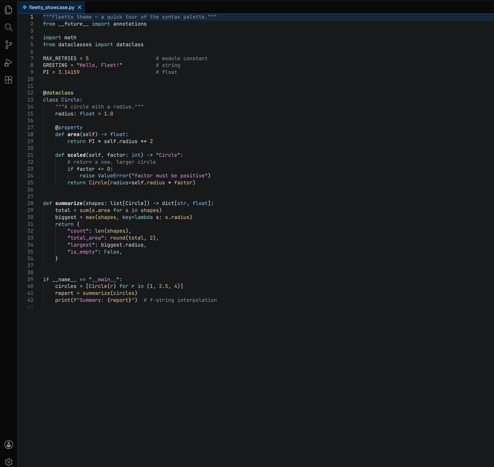
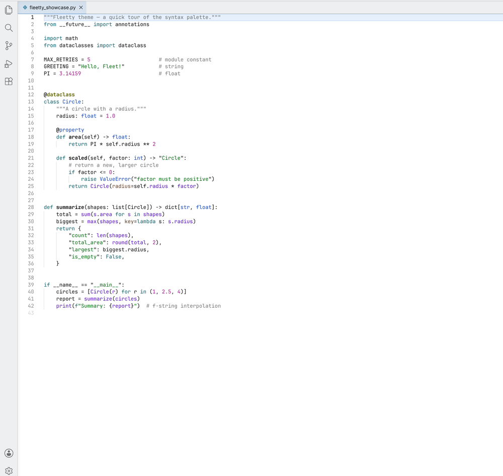

# Fleetty — JetBrains Fleet theme for VS Code

A pixel-faithful port of the **JetBrains Fleet** color scheme to Visual Studio Code,
in three variants: **Dark**, **Dark Purple**, and **Light**. Colors are taken directly
from Fleet's own exported theme files and verified one-to-one against the Fleet editor,
including Fleet's signature "island" layout (editor and sidebar surfaces floating on a
darker window chrome).



## Variants

| Theme | Description |
| --- | --- |
| **Fleetty Dark** | Fleet's default dark scheme — cyan keywords, pink strings, yellow numbers, blue types. |
| **Fleetty Dark Purple** | The dark scheme with Fleet's purple accent (selection, current line, focus). |
| **Fleetty Light** | Fleet's light scheme. |

### Light



## Install

1. Open the **Extensions** view (`Ctrl+Shift+X` / `Cmd+Shift+X`).
2. Search for **Fleetty**.
3. Click **Install**.

Then pick a variant with **Preferences: Color Theme** (`Ctrl+K Ctrl+T` / `Cmd+K Cmd+T`)
and choose *Fleetty Dark*, *Fleetty Dark Purple*, or *Fleetty Light*.

## What's covered

- Workbench UI colors across the editor, side bar, activity bar, tabs, status bar,
  panel, terminal, lists, inputs, notifications, diff editor, and more.
- TextMate token scopes and **semantic token** colors for many languages, including
  Python, JavaScript/TypeScript, Kotlin, Go, Rust, C/C++, C#, PHP, Ruby, Swift,
  HTML/CSS/SCSS/LESS, JSON, YAML, and Markdown.

Some languages need their own language extension installed for VS Code to tokenize them.
For example, Kotlin highlighting requires a Kotlin extension such as `fwcd.kotlin`.

> **Note:** A theme only controls colors. VS Code's overall layout (activity-bar
> placement, title-bar controls, file tree, icons) differs from Fleet and is not
> something a theme can change.

## Disclaimer

Fleetty is an **unofficial** theme and is **not affiliated with, endorsed by, or
sponsored by JetBrains**. "Fleet" and "JetBrains" are trademarks of JetBrains s.r.o.
This project only recreates Fleet's color palette for use in VS Code.

## Build from source

The `themes/*.json` files committed here are pre-built and are exactly what the
extension ships — no extra steps are needed to use or package it.

The Fleet theme **export files are not included** in this repository. To regenerate
the themes from scratch, export your own themes from Fleet and place them in the repo
root as `Fleetty-Light.json`, `Fleetty-Dark.json`, and `Fleetty-Dark-Purple.json`, then:

```sh
npm run build      # regenerate themes/*.json from your Fleet exports
npm run validate   # verify the generated themes are up to date
```

## Credits

Huge thanks to [@Elifbusra](https://github.com/Elifbusra) for the *Fleetty* name and the logo 💜

## License

[MIT](LICENSE) © Eren Özen
